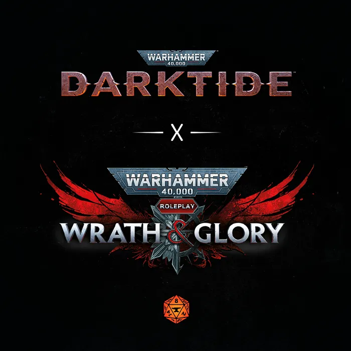
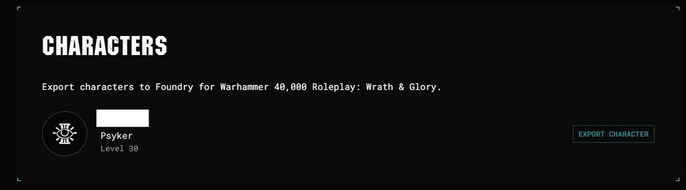
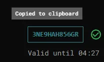
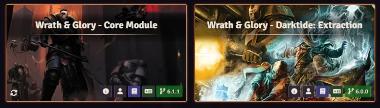
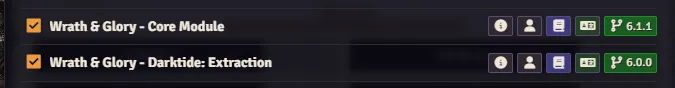
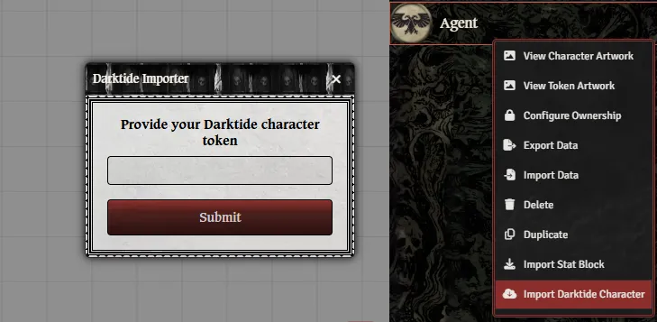

### Bring your Warhammer 40,000: Darktide character into Foundry!

In collaboration with [FatShark](https://www.fatshark.se/), we've developed an interface to bring your character into Wrath & Glory! See the steps below. 

{: .warning}
Note that the [Darktide Extraction](https://foundryvtt.com/packages/wng-darktide) module is required.

1. Login to your [account dashboard](https://accounts.atoma.cloud/dashboard)

    

2. Click **Export Character** and copy the export token.

    

3. In Foundry, ensure you've installed the modules necessary. This would be <strong>Wrath & Glory - Core Rulebook</strong> and <strong>Darktide: Extraction</strong>.

    

4. In an existing or new <strong>Wrath & Glory<strong> world, activate these modules. You can do so in the Settings tab under Manage Modules

    

5. Once activated, create a new Agent type Actor. Once created, right click the Actor in the sidebar and click Import Darktide Character.

    

6. Input your character's export token

### How does the importer work?

When importing a character, their class determines what **Archetype** they are given within **Wrath & Glory**. The Agent is given the base Attributes and skills of the Archetype, then the suggested Attributes and Skills are added on-top of those as advances. They are also given the Archetype's Gear list (weapons omitted, see below).

Next, each major **Talent** within Darktide is assigned an Item, which the Agent receives if they have that Talent. This could be a Weapon, Psychic Power, or Ability/Talent Item. They also receive more gear based on what weapon they have within **Darktide**.

Additionally, substituting in for the selected **Faction** bonus from Character Creation is the **Event** bonus. The **Defining Moments** available when creating the character within Darktide are assigned a bonus, which the Agent receives.

Finally, **every Talent on the tree** is assigned an Attribute or Skill, characters that have the Talent, when imported, gain an advancement to that Attribute/Skill. These were largely allocated randomly, though some tweaking has been done (and may yet still be needed) to remove nonsensical advancements (e.g. removing Psychic Mastery for anyone but Psykers, removing Scholar from Ogryns). If you wish to align the imported character's XP cost with existing characters, removing some of these advancements is definitely recommended.
